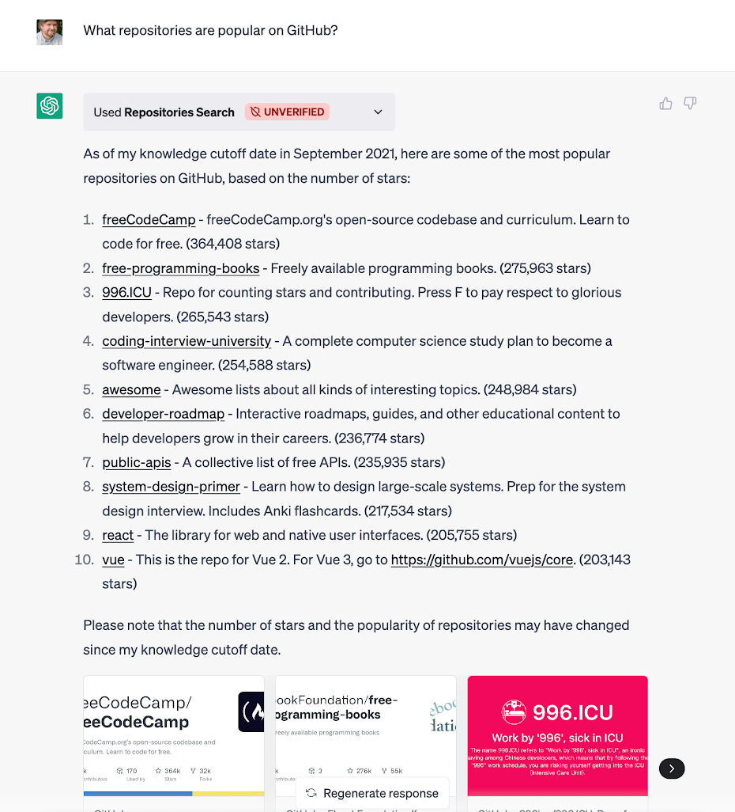

# Example ChatGPT Plugin for Cloudflare Workers

This is an example plugin showing how to build [ChatGPT plugins](https://platform.openai.com/docs/plugins/introduction) using [Cloudflare Workers](https://workers.dev). Using this example, you can deploy a plugin to Cloudflare Workers in just a few minutes.

The sample plugin allows ChatGPT users to search for repositories using GitHub's search API. The plugin is implemented in TypeScript and uses the [OpenAPI](https://www.openapis.org/) specification to define the plugin's API.

## Get started

0. Sign up for [Cloudflare Workers](https://workers.dev). The free tier is more than enough for most use cases.
1. Install [wrangler](https://developers.cloudflare.com/workers/cli-wrangler/install-update), the Cloudflare Workers CLI
2. Clone this project and install dependencies with `npm install`
3. Run `wrangler login` to login to your Cloudflare account in wrangler
4. Run `wrangler publish` to publish the plugin to Cloudflare Workers

## Usage

1. You can configure the `.well-known/ai-plugin.json` route in `ai-plugin.ts`.
2. Update the OpenAPI schema in `openapi.ts`.
3. For any new routes or additional code, update `index.ts`.

## Deploying to OpenAI's API

Follow the instructions [in the ChatGPT documentation](https://platform.openai.com/docs/plugins/introduction/plugin-flow) to deploy your plugin and begin using it in ChatGPT.